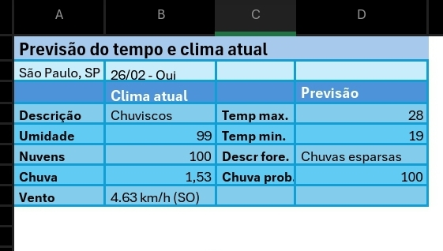

# 🌤️ Relatório do Clima de São Paulo em Excel

Script Python que consome a API HG Brasil para obter o clima
atual e a previsão do dia, salvando os dados automaticamente
em uma planilha Excel já formatada e pronta para uso.

## 🛠️ Tecnologias
- Python 3
- Requests
- OpenPyXL
- Python-dotenv
- API HG Brasil (hgbrasil.com/status/weather)

## ⚙️ Como usar

1. Clone o repositório
2. Instale as dependências:
pip install -r requirements.txt
3. Crie sua chave de API gratuita em **hgbrasil.com**
4. Crie um arquivo `.env` baseado no `.env.example` e adicione sua chave
5. Execute:
python clima.py

> O projeto já inclui o arquivo `clima.xlsx` com o design pronto.
> Não é necessário editar a planilha — basta executar o script.

## 📸 Resultado

